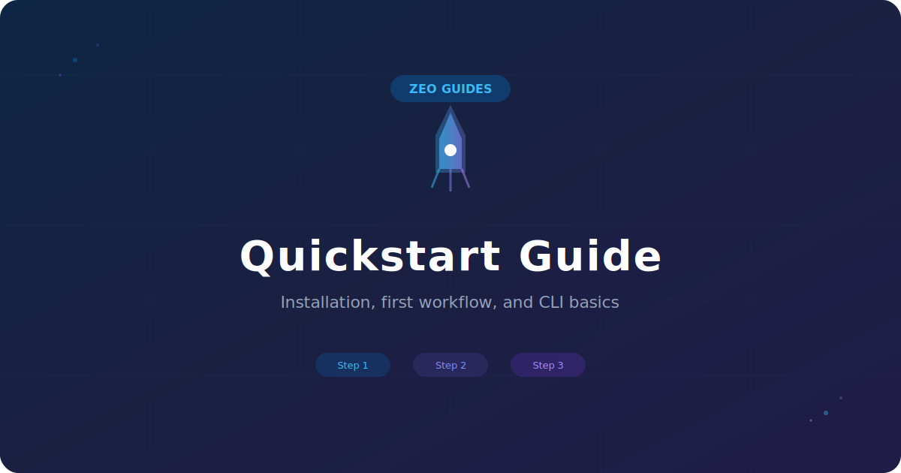
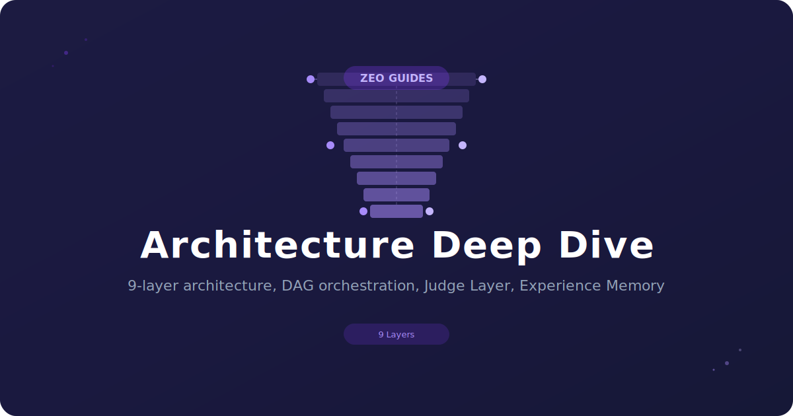
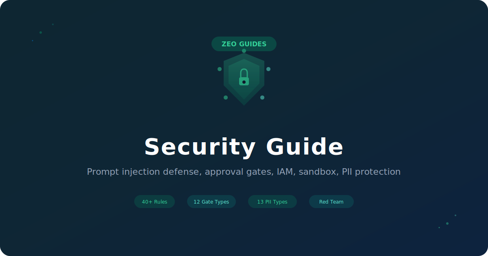

**Language:** [English](../../README.md) | [日本語](../ja-JP/README.md) | [简体中文](../zh-CN/README.md) | [繁體中文](../zh-TW/README.md) | **한국어** | [Português (Brasil)](../pt-BR/README.md) | [Türkçe](../tr/README.md)

# Zero-Employee Orchestrator

[](https://github.com/OrosiTororo/Zero-Employee-Orchestrator/stargazers)
[](https://github.com/OrosiTororo/Zero-Employee-Orchestrator/network/members)
[](https://github.com/OrosiTororo/Zero-Employee-Orchestrator/graphs/contributors)
[](../../LICENSE)


> **AI 오케스트레이션 플랫폼 — 설계 · 실행 · 검증 · 개선**

---

**AI를 조직으로 운영하기 위한 플랫폼 — 단순한 챗봇이 아닙니다.**

ZEO는 기존 AI 도구를 대체하는 것이 아니라 통합합니다. CrewAI, AutoGen, LangChain, Dify, Claude Cowork, n8n, Zapier 및 34개 이상의 비즈니스 앱을 단일 승인 게이트, 감사 추적, 보안 계층 아래에 연결합니다. 자연어로 업무 워크플로우를 정의하고, 역할 기반 위임으로 여러 AI 에이전트를 오케스트레이션하며, 인간 승인 게이트와 완전한 감사 가능성을 갖춘 상태에서 작업을 실행합니다. Self-Healing DAG, Judge Layer, Experience Memory를 갖춘 9계층 아키텍처로 구축되었습니다.

ZEO 자체는 무료 오픈소스입니다. LLM API 비용은 사용자가 각 공급업체에 직접 지불합니다.

---

## 시작하기

**방법을 선택하세요:**

| 방법 | 대상 | 소요 시간 | API 키 필요 여부 |
|------|------|----------|-----------------|
| **[데스크톱 앱](#️-데스크톱-앱-다운로드)** | 비기술 사용자 | 2분 | 불필요 (구독 모드) |
| **[CLI (pip install)](#-빠른-시작-cli)** | 개발자 | 2분 | 불필요 (구독 또는 Ollama) |
| **[Docker](#-docker)** | 셀프 호스트 / 프로덕션 | 5분 | 불필요 (구독 또는 Ollama) |

**시스템 요구사항:** Python 3.11+ (CLI), Node.js 22+ (프론트엔드 개발), RAM 4 GB 이상. Ollama 로컬 모델은 8 GB 이상의 RAM이 필요합니다.

---

## 🖥️ 데스크톱 앱 다운로드

사전 빌드된 데스크톱 설치 프로그램은 [Releases](https://github.com/OrosiTororo/Zero-Employee-Orchestrator/releases) 페이지에서 다운로드할 수 있습니다.

| OS | 파일 | 설명 |
|---|---|---|
| **Windows** | `-setup.exe` | Windows 설치 프로그램 (x64) |
| **macOS** | `.dmg` | macOS Universal (Intel + Apple Silicon) |
| **Linux** | `.AppImage` | 포터블 (설치 불필요, amd64) |
| **Linux** | `.deb` / `.rpm` | Debian/Ubuntu / Fedora/RHEL (amd64/x86_64) |

설치 후, **설정 마법사**가 다음 단계를 안내합니다:
1. **언어** — English, 日本語, 中文, 한국어, Português, Türkçe 중 선택 (설정에서 언제든지 변경 가능)
2. **LLM 공급업체** — AI 실행 방식 선택 (구독 모드는 API 키 불필요)
3. **첫 번째 작업** — 즉시 플랫폼 사용 시작

---

## 🚀 빠른 시작 (CLI)

### 1단계: 설치

```bash
# PyPI (권장)
pip install zero-employee-orchestrator

# 소스에서 설치
git clone https://github.com/OrosiTororo/Zero-Employee-Orchestrator.git
cd Zero-Employee-Orchestrator && pip install .

# Docker (자세한 내용은 Docker 섹션 참조)
docker compose -f docker/docker-compose.yml up -d
```

### 2단계: 설정

다음 중 **하나**를 선택하세요:

```bash
# 방법 A: API 키 불필요 — g4f를 통한 무료 Web AI 서비스 이용
zero-employee config set DEFAULT_EXECUTION_MODE subscription

# 방법 B: 완전 오프라인 — Ollama를 통한 로컬 모델 (인터넷 불필요)
zero-employee config set DEFAULT_EXECUTION_MODE free
zero-employee pull qwen3:8b

# 방법 C: API 키 — 최고 품질, 공급업체에 사용량 기반 과금
zero-employee config set OPENROUTER_API_KEY <your-key>  # or GEMINI_API_KEY, etc.
```

> **ZEO 자체는 무료입니다.** LLM API 비용(발생 시)은 사용자가 각 공급업체에 직접 지불합니다. 자세한 내용은 [USER_SETUP.md](../../USER_SETUP.md)를 참조하세요.

### 3단계: 시작

```bash
# 방법 A: start.sh (백엔드 + 프론트엔드를 자동으로 시작)
./start.sh
# → http://localhost:5173 열기

# 방법 B: 수동 시작
zero-employee serve              # API 서버 시작 (포트 18234)
cd apps/desktop/ui && pnpm dev   # 다른 터미널에서 프론트엔드 시작 (포트 5173)
# → http://localhost:5173 열기

# 방법 C: 채팅 모드만 사용 (Web UI 불필요)
zero-employee chat               # 기본 설정
zero-employee local --model qwen3:8b  # Ollama
```

> **참고:** `zero-employee serve`는 API 서버만 시작합니다. Web UI는 별도로 포트 5173에서 실행됩니다. 가장 쉬운 방법은 `start.sh`를 사용하는 것입니다.

### 4단계: 확인

```bash
zero-employee health              # 서버 상태 확인
zero-employee models              # 사용 가능한 모델 목록
zero-employee config list         # 설정 확인
```

### 언어 변경

기본 언어는 영어입니다. 다음 방법으로 시스템 전체(CLI, AI 응답, Web UI)를 일괄 전환할 수 있습니다:

```bash
# 시작 시 지정
zero-employee chat --lang ja      # 일본어
zero-employee chat --lang zh      # 중국어
zero-employee chat --lang ko      # 한국어
zero-employee chat --lang pt      # 포르투갈어
zero-employee chat --lang tr      # 터키어

# 영구 설정 (~/.zero-employee/config.json에 저장)
zero-employee config set LANGUAGE ko

# 실행 중 변경 (채팅 모드에서)
/lang en                          # 영어로 전환
/lang ja                          # 일본어로 전환
/lang zh                          # 중국어로 전환
/lang ko                          # 한국어로 전환
/lang pt                          # 포르투갈어로 전환
/lang tr                          # 터키어로 전환
```

데스크톱 앱에서는 **설정**에서 언제든지 언어를 변경할 수 있습니다.

---

## 🐳 Docker

### API + 프론트엔드 (권장)

```bash
docker compose -f docker/docker-compose.yml up -d
# → http://localhost:5173 열기
```

API 서버(포트 18234), 프론트엔드(포트 5173), 백그라운드 워커의 세 가지 서비스가 시작됩니다.

> **참고:** `SECRET_KEY` 환경 변수가 필요합니다. 생성 방법: `python -c "import secrets; print(secrets.token_urlsafe(32))"`

### API만

```bash
docker compose up -d
# → API는 http://localhost:18234/api/v1/ 에서 사용 가능
```

API 서버만 시작합니다. 데스크톱 앱 또는 자체 프론트엔드와 함께 사용하세요.

---

## 가이드

<table>
<tr>
<td width="33%">
<a href="../../docs/guides/quickstart-guide.md">

</a>
</td>
<td width="33%">
<a href="../../docs/guides/architecture-guide.md">

</a>
</td>
<td width="33%">
<a href="../../docs/guides/security-guide.md">

</a>
</td>
</tr>
<tr>
<td align="center"><b>빠른 시작 가이드</b><br/>첫 번째 워크플로우, CLI 기초.</td>
<td align="center"><b>아키텍처 심층 분석</b><br/>9계층 아키텍처, DAG, Judge Layer.</td>
<td align="center"><b>보안 가이드</b><br/>프롬프트 방어, 승인 게이트, 샌드박스.</td>
</tr>
</table>

---

## 📦 구성 내용

```
Zero-Employee-Orchestrator/
├── apps/
│   ├── api/                  # FastAPI 백엔드
│   │   └── app/
│   │       ├── core/               # 설정, DB, 보안, i18n
│   │       ├── api/routes/         # 47 REST API 라우트 모듈
│   │       ├── api/ws/             # WebSocket
│   │       ├── models/             # SQLAlchemy ORM
│   │       ├── schemas/            # Pydantic DTO
│   │       ├── services/           # 비즈니스 로직
│   │       ├── repositories/       # DB I/O 추상화
│   │       ├── orchestration/      # DAG, Judge, 상태 머신
│   │       ├── providers/          # LLM 게이트웨이, Ollama, RAG
│   │       ├── security/           # IAM, 시크릿, 정제, 프롬프트 방어
│   │       ├── policies/           # 승인 게이트, 자율 실행 경계
│   │       ├── integrations/       # Sentry, MCP, 외부 스킬, 브라우저 어시스트
│   │       └── tools/              # 외부 도구 커넥터
│   ├── desktop/              # Tauri v2 + React UI
│   ├── edge/                 # Cloudflare Workers
│   └── worker/               # 백그라운드 워커
├── skills/                   # 내장 스킬 (8개)
├── plugins/                  # 플러그인 매니페스트 (16개)
├── extensions/               # 익스텐션 매니페스트 (11개)
│   └── browser-assist/
│       └── chrome-extension/ # 브라우저 어시스트용 Chrome 확장 프로그램
├── packages/                 # 공유 NPM 패키지
├── docs/                     # 다국어 문서 & 가이드
│   ├── ja-JP/                # 日本語
│   ├── zh-CN/                # 简体中文
│   ├── zh-TW/                # 繁體中文
│   ├── ko-KR/                # 한국어
│   ├── pt-BR/                # Português (Brasil)
│   ├── tr/                   # Türkçe
│   └── guides/               # 아키텍처, 보안, 빠른 시작 가이드
└── assets/
    └── images/
        ├── guides/           # 가이드 헤더 이미지
        └── logo/             # 로고 에셋
```

---

## 🏗️ 9계층 아키텍처

```
┌─────────────────────────────────────────┐
│  1. User Layer       — 자연어로 목적 전달           │
│  2. Design Interview — 요구사항 탐색 및 심화         │
│  3. Task Orchestrator — DAG 분해 및 진행 관리       │
│  4. Skill Layer      — 전문 Skill + Context       │
│  5. Judge Layer      — Two-stage + Cross-Model QA  │
│  6. Re-Propose       — 반려 → 동적 DAG 재구성       │
│  7. State & Memory   — Experience Memory          │
│  8. Provider         — LLM 게이트웨이 (LiteLLM)     │
│  9. Skill Registry   — 게시 / 검색 / Import        │
└─────────────────────────────────────────┘
```

---

## 🎯 주요 기능

### 핵심 오케스트레이션

| 기능 | 설명 |
|------|------|
| **Design Interview** | 자연어 기반 요구사항 탐색 및 심화 |
| **Spec / Plan / Tasks** | 구조화된 중간 산출물 — 재사용, 감사, 반려 가능 |
| **Task Orchestrator** | DAG 기반 계획 생성, 비용 추정, 품질 모드 전환 |
| **Judge Layer** | 규칙 기반 1차 판정 + Cross-Model 고정밀 검증 |
| **Self-Healing / Re-Propose** | 실패 시 자동 재계획, 동적 DAG 재구성 |
| **Experience Memory** | 과거 실행에서 학습하여 미래 성능 향상 |

### 확장성

| 기능 | 설명 |
|------|------|
| **Skill / Plugin / Extension** | 3계층 확장 체계 (완전한 CRUD 관리) |
| **자연어 스킬 생성** | 자연어로 설명 → AI가 자동 생성 (안전성 검사 포함) |
| **Skill 마켓플레이스** | 커뮤니티 스킬 게시, 검색, 리뷰, 설치 |
| **외부 스킬 가져오기** | GitHub 저장소에서 스킬 가져오기 |
| **자기 개선** | AI가 자체 스킬을 분석하고 개선 (승인 필수) |
| **메타 스킬** | AI가 배우는 방법을 배움 (Feeling / Seeing / Dreaming / Making / Learning) |

### AI 기능

| 기능 | 설명 |
|------|------|
| **브라우저 어시스트** | Chrome 확장 프로그램 오버레이 — AI가 실시간으로 화면 확인 |
| **미디어 생성** | 이미지, 동영상, 음성, 음악, 3D — 동적 공급업체 등록 지원 |
| **앱 커넥터 허브** | 34+ 앱 (Obsidian, Notion, Google Workspace, Microsoft 365 등) |
| **AI 도구 통합** | 21개 카테고리, 55+ 외부 도구 |
| **A2A 통신** | 에이전트 간 P2P 메시징, 채널, 협상 |
| **분신 AI** | 사용자의 판단 기준을 학습하고 함께 성장 |
| **비서 AI** | 브레인 덤프 → 구조화된 작업, 사용자와 AI 조직의 다리 역할 |
| **오퍼레이터 프로필** | Cowork 스타일의 자기소개 + 글로벌 지침 — AI가 사용자의 역할, 우선순위, 작업 스타일에 맞게 응답을 개인화 |
| **태스크 디스패치** | Cowork Dispatch에서 영감을 받은 백그라운드 작업 — 발행 후 잊기 방식, 상태 폴링 지원 |
| **리퍼포즈 엔진** | 1개 콘텐츠를 10가지 미디어 형식으로 자동 변환 |

### 보안

| 기능 | 설명 |
|------|------|
| **프롬프트 인젝션 방어** | 5개 카테고리, 28+ 탐지 패턴 |
| **승인 게이트** | 14개 카테고리의 위험 작업에 인간 승인 필수 |
| **파일 샌드박스** | AI가 접근 가능한 폴더를 사용자 허가제로 제한 (기본: STRICT) |
| **데이터 보호** | 업로드/다운로드 정책 제어 (기본: LOCKDOWN) |
| **PII 보호** | 13개 카테고리 개인정보 자동 탐지 및 마스킹 |
| **IAM** | 인간/AI 계정 분리, AI의 시크릿 및 관리 권한 접근 거부 |
| **레드팀 보안** | 8개 카테고리, 20+ 테스트 자체 취약점 평가 |

### 운영

| 기능 | 설명 |
|------|------|
| **멀티 모델 지원** | 동적 카탈로그, 자동 폴백, 작업별 공급업체 지정 |
| **다국어(i18n)** | 6개 언어(EN / JA / ZH / KO / PT / TR)— UI, AI 응답, CLI |
| **자율 운영** | Docker / Cloudflare Workers — PC가 꺼져 있어도 실행 |
| **24/365 스케줄러** | 9가지 트리거 유형: cron, 티켓 생성, 예산 임계값 등 |
| **iPaaS 통합** | n8n / Zapier / Make Webhook 통합 |
| **클라우드 네이티브** | AWS / GCP / Azure / Cloudflare 추상화 계층 |
| **거버넌스 및 컴플라이언스** | GDPR / HIPAA / SOC2 / ISO27001 / CCPA / APPI |

---

## 🔒 보안

ZEO는 **보안 우선**으로 설계된 다층 방어를 갖추고 있습니다:

| 계층 | 설명 |
|------|------|
| **프롬프트 인젝션 방어** | 외부 입력의 명령 주입을 탐지하고 차단 (5개 카테고리, 28+ 패턴) |
| **승인 게이트** | 14개 카테고리의 위험 작업(전송, 삭제, 과금, 권한 변경 등)에 인간 승인 필수 |
| **자율 실행 경계** | AI가 자율적으로 실행할 수 있는 작업을 명시적으로 제한 |
| **IAM 및 도구 권한** | 인간/AI 계정 분리; 역할 기반 도구 권한(5개 기본 정책: secretary, researcher, reviewer, executor, admin)으로 에이전트별 최소 권한 적용 |
| **킬 스위치** | UI 버튼 또는 API(`/kill-switch/activate`)를 통해 모든 활성 실행을 긴급 중지. 재개할 때까지 새 실행을 차단 |
| **단계적 Judge** | 3단계 검증: LIGHTWEIGHT(규칙만) → STANDARD(+정책) → HEAVY(+크로스모델). 저위험 작업의 비용을 줄이면서 고위험 작업에는 완전한 검증 유지 |
| **메모리 신뢰도** | Experience Memory 항목이 소스 유형, 신뢰 수준(0.0-1.0), 검증 상태, 만료일을 추적. 신뢰할 수 있는 메모리(≥0.7, 미만료)만 사용 |
| **시크릿 관리** | Fernet 암호화, 자동 마스킹, 로테이션 지원 |
| **정제** | API 키, 토큰, 개인정보의 자동 제거 |
| **보안 헤더** | 모든 응답에 CSP, HSTS, X-Frame-Options 추가 |
| **속도 제한** | slowapi 기반 API 속도 제한 |
| **감사 로그** | 모든 중요 작업 기록 (설계 단계부터 내장, 나중에 추가한 것이 아님) |

취약점 보고는 [SECURITY.md](../../SECURITY.md)를 참조하세요.

---

## 🖥️ CLI 레퍼런스

```bash
zero-employee serve              # API 서버 시작
zero-employee serve --port 8000  # 포트 지정
zero-employee serve --reload     # 핫 리로드

zero-employee chat               # 채팅 모드 (모든 공급업체)
zero-employee chat --mode free   # 무료 모드 (Ollama / g4f)
zero-employee chat --lang ko     # 언어 선택

zero-employee local              # 로컬 채팅 (Ollama)
zero-employee local --model qwen3:8b --lang ko

zero-employee models             # 설치된 모델 목록
zero-employee pull qwen3:8b      # 모델 다운로드

zero-employee config list        # 모든 설정 표시
zero-employee config set <KEY>   # 값 설정
zero-employee config get <KEY>   # 값 가져오기

zero-employee db upgrade         # DB 마이그레이션
zero-employee health             # 헬스 체크
zero-employee security status    # 보안 상태
zero-employee update             # 최신 버전으로 업데이트
```

---

## 🤖 지원 LLM 모델

`model_catalog.json`으로 통합 관리 — 코드 변경 없이 모델 교체 가능.

| 모드 | 설명 | 예시 |
|------|------|------|
| **Quality** | 최고 품질 | Claude Opus, GPT, Gemini Pro |
| **Speed** | 빠른 응답 | Claude Haiku, GPT Mini, Gemini Flash |
| **Cost** | 저비용 | Haiku, Mini, Flash Lite, DeepSeek |
| **Free** | 무료 | Gemini 무료 티어, Ollama 로컬 |
| **Subscription** | API 키 불필요 | g4f 경유 |

작업별 공급업체 지정 지원 — 작업마다 공급업체, 모델, 실행 모드를 지정할 수 있습니다.

---

## 🧩 Skill / Plugin / Extension

### 3계층 확장 체계

| 유형 | 설명 | 예시 |
|------|------|------|
| **Skill** | 단일 목적 전문 처리 | spec-writer, review-assistant, browser-assist |
| **Plugin** | 여러 Skill 번들 | ai-secretary, ai-self-improvement, youtube |
| **Extension** | 시스템 통합 및 인프라 | mcp, oauth, notifications, browser-assist |

### 자연어로 스킬 생성

```bash
POST /api/v1/registry/skills/generate
{
  "description": "긴 문서를 3가지 핵심 포인트로 요약하는 스킬"
}
```

18가지 위험 패턴을 자동 탐지. 안전성 검사를 통과한 스킬만 등록됩니다.

---

## 🌐 브라우저 어시스트

Chrome 확장 프로그램 오버레이 채팅 — AI가 실시간으로 화면을 확인하고 안내합니다.

- **오버레이 채팅**: 모든 웹사이트에서 직접 채팅 UI 표시
- **실시간 화면 공유**: 수동 스크린샷 없이 AI가 화면 확인
- **오류 진단**: AI가 화면의 오류 메시지를 읽고 수정 방법 제안
- **폼 지원**: 필드별 단계적 안내
- **프라이버시 우선**: 스크린샷은 일시적으로만 처리, PII 자동 마스킹, 비밀번호 필드 자동 블러

### 설정

```
1. Chrome에서 extensions/browser-assist/chrome-extension/ 로드
   → chrome://extensions → 개발자 모드 → "압축해제된 확장 프로그램 로드"
2. 모든 웹사이트에서 채팅 아이콘 클릭
3. 텍스트로 질문하거나 스크린샷 버튼으로 화면을 AI에게 공유
```

---

## 🛠️ 기술 스택

### 백엔드
- Python 3.11+ / FastAPI / uvicorn
- SQLAlchemy 2.x (async) + Alembic
- SQLite (개발) / PostgreSQL (프로덕션 권장)
- LiteLLM Router SDK
- bcrypt / Fernet 암호화
- slowapi 속도 제한

### 프론트엔드
- React 19 + TypeScript + Vite
- shadcn/ui + Tailwind CSS
- TanStack Query + Zustand

### 데스크톱
- Tauri v2 (Rust) + Python sidecar

### 배포
- Docker + docker-compose
- Cloudflare Workers (서버리스)

---

## ❓ FAQ

<details>
<summary><b>시작하려면 API 키가 필요한가요?</b></summary>

아닙니다. 구독 모드(키 불필요) 또는 Ollama(완전 오프라인 로컬 AI)로 이용할 수 있습니다. 위의 빠른 시작 섹션을 참조하세요.
</details>

<details>
<summary><b>비용은 얼마인가요?</b></summary>

ZEO 자체는 무료입니다. LLM API 비용은 각 공급업체(OpenAI, Anthropic, Google 등)에 직접 지불합니다. Ollama 로컬 모델을 사용하면 완전 무료로 운영할 수도 있습니다.
</details>

<details>
<summary><b>여러 LLM 공급업체를 동시에 사용할 수 있나요?</b></summary>

네. ZEO는 작업별 공급업체 지정을 지원합니다 — 동일한 워크플로우에서 고품질 스펙 리뷰에는 Claude를, 빠른 작업 실행에는 GPT를 사용하는 식으로 구분할 수 있습니다.
</details>

<details>
<summary><b>데이터는 안전한가요?</b></summary>

ZEO는 셀프 호스트를 전제로 설계되었습니다. 데이터는 모두 사용자의 인프라에 보관됩니다. 파일 샌드박스 기본값은 STRICT, 데이터 전송 기본값은 LOCKDOWN, PII 자동 탐지는 기본 활성화입니다.
</details>

<details>
<summary><b>AutoGen / CrewAI / LangGraph와의 차이점은?</b></summary>

ZEO는 **업무 워크플로우 플랫폼**이며, 개발자용 프레임워크가 아닙니다. 인간 승인 게이트, 감사 로그, 3계층 확장 체계, 브라우저 어시스트, 미디어 생성, 완전한 REST API를 제공합니다 — 모두 AI를 조직으로 운영하기 위해 설계되었으며, 단순히 프롬프트를 체이닝하는 것이 아닙니다.
</details>

---

## 🧪 개발

```bash
# 설정
git clone https://github.com/OrosiTororo/Zero-Employee-Orchestrator.git
cd Zero-Employee-Orchestrator
pip install -e ".[dev]"

# 시작 (핫 리로드)
zero-employee serve --reload

# 테스트
pytest apps/api/app/tests/

# 린트
ruff check apps/api/app/
ruff format apps/api/app/
```

---

## 🤝 기여

기여를 환영합니다.

1. Fork → Branch → PR (표준 흐름)
2. 보안 문제: [SECURITY.md](../../SECURITY.md)에 따라 비공개 보고
3. 코딩 규칙: ruff 포맷, 타입 힌트 필수, async def

---

## 💜 스폰서

이 프로젝트는 무료 오픈소스입니다. 스폰서십이 프로젝트의 지속적인 유지 관리와 성장을 지원합니다.

[**스폰서 되기**](https://github.com/sponsors/OrosiTororo)

---

## 🌟 Star 히스토리

[](https://star-history.com/#OrosiTororo/Zero-Employee-Orchestrator&Date)

---

## 📄 라이선스

MIT — 자유롭게 사용하고 수정하세요. 가능하다면 기여해 주세요.

---

<p align="center">
  <strong>Zero-Employee Orchestrator</strong> — AI를 조직으로 운영.<br>
  보안, 감사 가능성, 인간의 감독을 핵심으로 구축되었습니다.
</p>
